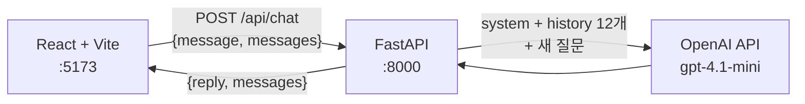

# ✈️ 하늘길 여행사 AI 상담 챗봇


여행 상담에 특화된 AI 고객센터 챗봇입니다. 여행 시기·인원·출발지·예산을 **순서대로 수집**한 뒤 일정 추천을 돕고, 가격·좌석처럼 확정할 수 없는 정보는 **직원 확인으로 안내**합니다. 범용 챗봇이 아니라, 시스템 프롬프트로 행동 범위를 좁힌 **도메인 특화 상담원**입니다.

## Why a system prompt harness?

이 프로젝트의 핵심은 UI가 아니라 **시스템 프롬프트 설계**입니다. XML 태그로 구획화한 프롬프트가 AI의 행동 원칙을 코드처럼 규정합니다:

| 구획 | 규칙 |
| --- | --- |
| `<역할>` | 하늘길 여행사 고객센터 AI 상담원 |
| `<대화_원칙>` | 존댓말 · 5문장 이내 · 다음 행동 제안 |
| `<정보_수집_절차>` | 시기 → 인원 → 출발지 → 예산 순서 강제 |
| `<사실_기준>` | 실시간 가격·좌석은 확정하지 않고 직원 확인 안내 |
| `<범위_밖_질문>` | 여행 외 질문은 정중히 거절 |
| `<안전>` | 개인정보 요구 금지 · 결제는 직원 연결 |

> "제주도 추천해줘" → 시기부터 질문. "자바 설명해줘" → 정중히 거절.
> 프롬프트가 곧 하네스(harness)로 동작합니다.

## Architecture



- **무상태(stateless) 백엔드** — 대화 기록은 프론트가 보관하고 매 요청에 전달. 서버는 최근 12개(`MAX_HISTORY_MESSAGES`)만 슬라이싱해 토큰을 제어
- **Pydantic 3종 모델**(`ChatMessage` / `ChatRequest` / `ChatResponse`)로 요청·응답 검증
- 시스템 프롬프트는 OpenAI 요청에만 포함, 프론트 반환 `messages`에는 미포함

## Quickstart

**Backend**

```bash
git clone https://github.com/yoorobo/skyweb.git
cd skyweb

python -m venv .venv
.venv\Scripts\activate          # Windows
# source .venv/bin/activate     # macOS / Linux

pip install -r requirements.txt
uvicorn backend.main:app --reload    # → http://localhost:8000/docs
```

**Frontend** (새 터미널)

```bash
cd skyweb/frontend
npm install
npm run dev                          # → http://localhost:5173
```

## Configuration

프로젝트 루트에 `.env` 파일을 만듭니다. `.env`는 절대 커밋하지 않습니다.

| 변수 | 설명 | 기본값 |
| --- | --- | --- |
| `OPENAI_API_KEY` | OpenAI API 키 | (필수) |
| `OPENAI_MODEL` | 사용 모델 | `gpt-4.1-mini` |
| `FRONTEND_ORIGIN` | CORS 허용 프론트 주소 | `http://localhost:5173` |

## Project structure

```text
skyweb/
├─ backend/
│  └─ main.py          # SYSTEM_PROMPT · Pydantic 모델 · /api/chat
├─ frontend/
│  └─ src/App.jsx      # 채팅 UI · fetch 연동 · 상태 관리
└─ requirements.txt
```

## Roadmap

- [ ] 상담 로그 저장 (수집된 여행 조건의 구조화 저장)
- [ ] 시스템 프롬프트 버전 관리 (하네스 변경 이력)
- [ ] 배포 (AWS)

---

*KDT 두드림 과정 1차 프로젝트 · 생성형 AI 풀스택*
